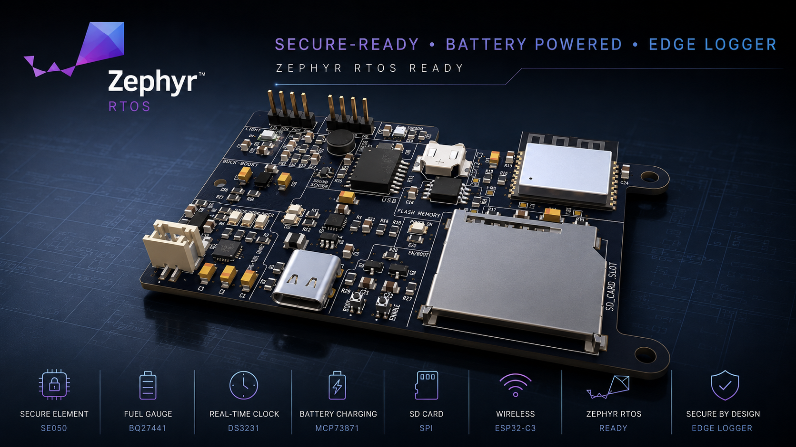

<!-- Adjust the title/tagline if you want a different overarching project name — this uses the Rev 2 name since it's the current state of the project. -->
# Secure-Ready Battery-Powered Edge Logger
<p align="center">  </p>
# Secure-Ready Battery-Powered Edge Logger

A custom ESP32-C3 hardware/firmware platform, developed across two revisions — from a general-purpose IoT sensor board into a battery-aware, timestamped, secure-ready edge data logger. Designed end-to-end in KiCad, ported to Zephyr RTOS.

This repository contains the full hardware design (schematics, PCB layout, BOM) for both revisions.

---

## Overview

The project began as the **IoT Development Board** (**Rev 1**) — a general-purpose ESP32-C3 sensor/data-logging platform: WiFi/BLE connectivity, environmental and ambient-light sensing, audio capture, local storage, and LiPo charging on a single compact PCB.

**Rev 2, the Secure-Ready Battery-Powered Edge Logger**, evolved that platform with a regulated buck-boost power stage holding 3.3V across the full LiPo discharge range, a battery fuel gauge with Kelvin current sensing, a battery-backed real-time clock for offline timestamping, and a hardware secure element for protected device identity and cryptographic key storage. The name change is deliberate, not cosmetic — it reflects the shift from a general-purpose development board to a system built around a specific mission: unattended, battery-aware, timestamped, secure-ready edge logging.

Both revisions share the same core sensing/storage/connectivity architecture; Rev 2 adds the hardware needed to take the board from *prototype* toward *deployable product*.

---

## Repository Structure

```
├── hardware/
│   ├── rev1/                     # IoT Development Board (original revision)
│   │   ├── README.md             # Full hardware documentation for Rev 1
│   │   └── ...                   # KiCad project, BOM, libraries
│   │
│   └── rev2/                     # Secure-Ready Battery-Powered Edge Logger (current revision)
│       ├── README.md             # Full hardware documentation for Rev 2
│       └── ...                   # KiCad project, BOM, libraries
│

│
└── README.md                     # This file
```

> Each revision is self-contained — its own KiCad project, its own Gerbers/BOM, and its own README with full component-level documentation, block diagrams, and design notes. Start here for the high-level picture, then go to the revision folder for detail.

---

## Hardware Revisions at a Glance

| | Rev 1 — IoT Development Board | Rev 2 — Secure Edge Logger |
|---|---|---|
| MCU | ESP32-C3-WROOM-02-H4 | ESP32-C3-WROOM-02-H4 |
| Power regulation | LM1117-3.3 linear regulator | TPS63802 buck-boost (regulated 3.3V across full LiPo range) |
| Battery charging | MCP73871 (charge + power-path) | MCP73871 (unchanged) |
| Battery state monitoring | Charge-status LEDs only | + BQ27441-G1A fuel gauge, 10mΩ Kelvin current sensing |
| Timekeeping | None (network time only) | + DS3231SN battery-backed RTC |
| Security | None | + NXP EdgeLock SE050E2 secure element |
| Storage | microSD + W25Q32 SPI NOR flash | microSD + W25Q32 SPI NOR flash (unchanged) |
| Sensing | BME280, TEMT6000X01, mic + MAX4466 preamp | Unchanged |
| Connectivity | USB-C, CP2102N USB-UART, OLED I²C header | Unchanged |
| Firmware target | Zephyr RTOS | Zephyr RTOS |

Full rationale for each Rev 2 change — including the buck-boost layout, Kelvin sensing wiring, and shared I²C bus considerations across five devices — is documented in [`hardware/rev2/README.md`](hardware/rev2/README.md).

---

## Design Evolution: The Engineering Behind Rev 1 → Rev 2

Rev 1 answered a narrower question: *can this sensing/connectivity architecture work on a single ESP32-C3 board?* It did — but running it as something closer to an actual field-deployed logger, rather than a bench prototype, surfaced four real limitations that Rev 1's architecture had no answer for. Rev 2 exists specifically to close those four gaps.

**1. The power rail wasn't guaranteed across the battery's actual operating range.**
The LM1117 is a linear regulator — it can only step *down*, and needs a few hundred millivolts of headroom above 3.3V to stay in regulation. A single-cell LiPo spends a meaningful portion of its discharge curve at or below that threshold, well before the cell is actually empty. In practice, that meant the system rail could sag or brown out with real battery capacity still remaining — the board would report "low battery" behavior driven by the regulator's limits, not the battery's. The **TPS63802 buck-boost** converter can step the rail up *or* down as needed, holding a stable 3.3V across the LiPo's full discharge range. The trade-off is real: an inductor-based switching regulator is a more complex layout than a 3-pin LDO (switching-node placement, input/output capacitor proximity), but it removes an artificial ceiling on usable battery capacity.

**2. Battery state was inferred, not measured.**
Rev 1's only battery-state signal was the MCP73871's charge-status LEDs — charging, charged, or power-good. That tells you the *charger's* state, not the battery's: no state-of-charge percentage, no remaining runtime estimate, no visibility into battery health over repeated cycles. For a device meant to log unattended in the field, "the LED is off" isn't useful data. The **BQ27441-G1A fuel gauge**, paired with a 10mΩ Kelvin-sensed shunt for accurate current measurement, gives the firmware real coulomb-counted state-of-charge and capacity data — the difference between guessing how much runtime is left and actually knowing.

**3. Timestamps depended on the network being present, and couldn't survive a real power interruption.**
The ESP32-C3 does have an internal RTC timer, and it runs independently of WiFi — but it has two limitations that make it unsuitable as the sole time source for an offline logger. First, it has no absolute time reference of its own; it only counts elapsed ticks, so it needs to be told the actual date/time at least once, which in Rev 1 meant NTP over WiFi. Second, and more importantly, it has no dedicated backup power domain — it's powered from the same rail as the rest of the chip, so a genuine power interruption (battery disconnected, fully depleted) resets it, and any subsequent logging either loses accurate timestamping or needs a full resync before it can be trusted again. That's a direct conflict with the point of an edge logger, which by definition needs to keep working — and keep accurate time — when disconnected or power-cycled. The **DS3231SN**, with its own dedicated backup supply, keeps ticking through main-power interruptions entirely independently of the ESP32-C3 and of network availability — log integrity no longer depends on the device staying connected or staying powered.

**4. There was no way to prove a device's identity, or protect anything it might need to keep secret.**
Rev 1 had no mechanism for device authentication at all. Any private key or credential would have had to live in the ESP32-C3's own flash — readable by anyone who can extract the chip's contents, meaning a physically compromised device could be cloned or impersonated with no way to detect it. The **SE050E2 secure element** generates and stores keys internally and performs signing/crypto operations without ever exposing key material to the application processor. This is explicitly a *hardware readiness* change, not a finished feature — the chip makes protected device identity possible; actual authentication behavior still has to be implemented and provisioned at the firmware level.

Taken together, Rev 1 — the **IoT Development Board** — validated *that the concept works*. Rev 2 — the **Secure-Ready Battery-Powered Edge Logger** — is the set of changes needed to start asking whether it could actually be *trusted and deployed*: accurate power delivery, real battery visibility, time integrity without a network, and a hardware root of trust. The rename reflects that shift, from a general platform to a system built for a specific job.

---

## Firmware

Both revisions target a common **Zephyr RTOS** board port (`iot_sensor_node_esp32c3`), built from scratch rather than as an overlay on an existing Espressif reference board — the SoC layer is inherited from Zephyr's existing ESP32-C3 support, with Devicetree, pinctrl, and Kconfig scoped to this board's actual hardware.

See [`zephyr/README.md`](zephyr/README.md) for the full board architecture, peripheral integration (I²C, SPI, ADC, UART, GPIO), debugging/OpenOCD setup, and the specific integration issues encountered and resolved during the port.

---

## Design Tools

- **Schematic capture & PCB layout:** KiCad 10
- **Electrical/design verification:** KiCad ERC & DRC
- **Firmware / board support:** Zephyr RTOS
- **Secure-element middleware:** NXP Plug & Trust (SE050E2)
- **Hardware configuration:** Silicon Labs Simplicity Studio / Xpress Configurator

---

## Where to Go Next

- **New to the project?** Start with [`hardware/rev1/README.md`](hardware/rev1/README.md) for the original, simpler architecture.
- **Interested in the current hardware?** Go to [`hardware/rev2/README.md`](hardware/rev2/README.md) for the full secure edge-logger design.
- **Interested in the firmware/RTOS side?** Go to [`zephyr/README.md`](zephyr/README.md) for the board port documentation.

---

## Acknowledgments

Board design informed by manufacturer reference designs and application notes from Espressif, Microchip, Texas Instruments, NXP, Analog Devices/Maxim, Silicon Labs, Bosch Sensortec, Winbond, and the Zephyr Project.
