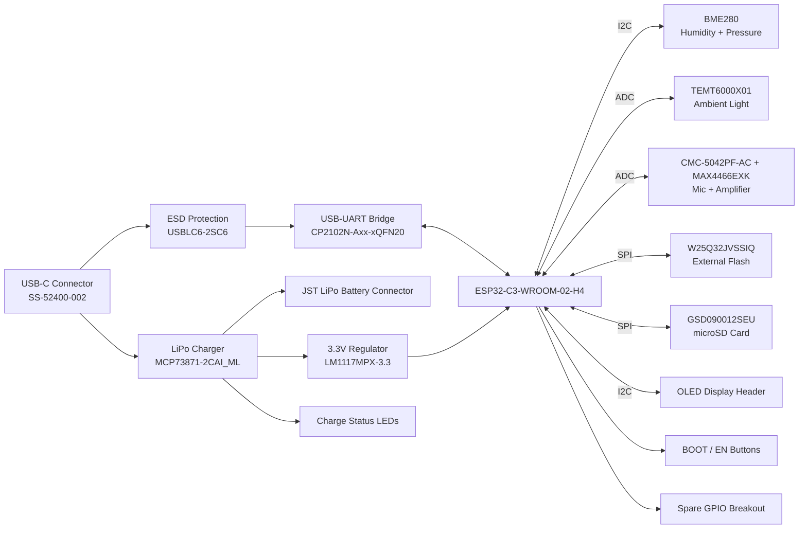

# Custom IoT Development Board — ESP32-C3

A custom-designed IoT development board built around the **ESP32-C3-WROOM-02**, featuring integrated LiPo battery charging, environmental sensing, ambient light sensing, audio capture, on-board storage (flash + SD card), and a USB-C interface with full USB-to-UART programming support. Designed end-to-end in **KiCad 10**, from schematic capture through PCB layout and routing.

---

## Overview

This board was designed as a general-purpose sensor/data-logging platform for IoT applications — combining wireless connectivity (WiFi/BLE via the ESP32-C3), multiple onboard sensors, local storage, and rechargeable battery power into a single compact PCB.

## Aplications
- IoT edge devices for environmental monitoring.
- Battery-powered data logging systems.
- Prototyping platform for ESP32-based projects.

**Key design goals:**
- Fully USB-C powered and rechargeable (no external charger required)
- Onboard environmental, light, and audio sensing
- Local data logging via SD card, with dedicated flash for firmware/configuration
- Standard USB-to-UART programming/debugging, no external programmer needed
- Expandable via an I²C OLED connector and a breakout header for spare GPIOs

---

## Block Diagram



---

## Hardware Overview

### Power Subsystem
| Component | Part Number | Function |
|---|---|---|
| USB-C Connector | SS-52400-002 | Main power/data input |
| ESD Protection | USBLC6-2SC6 | Protects USB D+/D- from ESD transients |
| LiPo Charger IC | MCP73871-2CAI_ML | Single-cell Li-Ion/LiPo charge management with power-path support |
| Voltage Regulator | LM1117MPX-3.3_NOPB | Regulates system rail to 3.3V |
| Battery Connector | JST 2-pin | Single-cell LiPo battery input |
| Status Indicators | LED x3 | Charging / Charged / Power-Good status |

The MCP73871's integrated power-path management allows the board to run directly from USB power while simultaneously charging the battery, and seamlessly switches to battery power when USB is disconnected — with no interruption to the system rail.

### Core & Connectivity
| Component | Part Number | Function |
|---|---|---|
| MCU | ESP32-C3-WROOM-02-H4 | RISC-V, WiFi + BLE, main system controller |
| USB-UART Bridge | CP2102N-Axx-xQFN20 | USB-to-serial for programming/debugging |
| Flash Memory | W25Q32JVSSIQ | 32Mbit external SPI flash (firmware/config storage) |
| SD Card Socket | GSD090012SEU | microSD card slot (bulk data storage: logs, audio, images) |

Programming and debugging are handled over native USB via the CP2102N, with automatic bootloader entry through a DTR/RTS-driven transistor reset circuit, plus manual BOOT and EN pushbuttons as a hardware fallback.

### Sensors
| Component | Part Number | Interface | Function |
|---|---|---|---|
| Environmental Sensor | BME280 | I²C | Humidity, barometric pressure, temperature |
| Ambient Light Sensor | TEMT6000X01 | Analog (ADC) | Ambient light intensity |
| Microphone Capsule | CMC-5042PF-AC | Analog | Electret condenser microphone |
| Mic Preamplifier | MAX4466EXK+T | Analog (ADC) | Adjustable-gain (25x–125x) microphone amplifier |

### User Interface / Expansion
- **BOOT** and **EN** pushbuttons for manual firmware flashing / reset
- **OLED display header** (I²C, 4-pin) for an external SSD1306-style display
- **Breakout header** exposing spare GPIOs (GPIO8, GPIO18, GPIO19) plus 3.3V/GND for future expansion

---

## Shared Bus Architecture

**SPI bus** (SD card + external flash, daisy-chained MOSI/MISO/SCLK, independent CS lines):
```
ESP32 MOSI ──┬──▶ SD Card MOSI ──▶ Flash MOSI
ESP32 MISO ──┼──◀ SD Card MISO ──◀ Flash MISO
ESP32 SCLK ──┴──▶ SD Card SCLK ──▶ Flash SCLK
ESP32 CS1  ─────▶ SD Card CS (dedicated)
ESP32 CS2  ─────▶ Flash CS (dedicated)
```

**I²C bus** (BME280 + OLED header, shared SDA/SCL with pull-ups):
```
ESP32 SDA ──┬──▶ BME280 SDA
            └──▶ OLED SDA
ESP32 SCL ──┬──▶ BME280 SCL
            └──▶ OLED SCL
```

---

## Design Tools

- **Schematic capture & PCB layout:** KiCad 10
- **Simulation/verification:** KiCad ERC & DRC (Electrical Rules Checker / Design Rules Checker)
- **Firmware:** successfully migrated to **Zephyr RTOS**
- **Hardware config tools:** Silicon Labs Simplicity Studio (for one-time CP2102N GPIO/TXT-RXT configuration)

---

## Repository Structure

This is a native **KiCad 10** project — the schematic is split hierarchically across multiple sheets, with sensors and user-interface elements broken out into their own sub-sheet files for readability.

```
├── IOT DEV BOARD.kicad_pro       # Main KiCad project file
├── IOT DEV BOARD.kicad_sch       # Root schematic sheet
├── IOT DEV BOARD.kicad_pcb       # PCB layout
├── ESP32-C3-02.kicad_sch         # Sub-sheet: MCU + core connectivity
├── sensors.kicad_sch             # Sub-sheet: BME280, light sensor, mic/amp
├── userInterface.kicad_sch       # Sub-sheet: BOOT/EN buttons, OLED header, breakout
│
├── ESP32_IOT_BOARD_GERBER/       # Exported Gerber/drill files for fabrication
├── Libraries/                    # Custom footprints and symbols
├── BOM.csv                       # Bill of materials
├── fp-lib-table                  # Footprint library table
├── sym-lib-table                 # Symbol library table
└── output.json                   # Exported netlist/data
```

> Lock files (`*.lck`), `.history/`, and `.git/` are local/version-control housekeeping and not part of the design itself.

---

## Known Issues & Design Notes

- **GPIO5 / ADC2 conflict:** GPIO5 is the ESP32-C3's only ADC2 channel, and ADC2 is unreliable while WiFi is active (and affected by a known silicon errata on some chip revisions). Analog signals (e.g. microphone, light sensor) must use **ADC1 pins (GPIO0–GPIO4)** instead.
- **CP2102N TXT/RXT indicator LEDs:** these pins default to plain GPIO mode from the factory and do **not** blink out of the box — they must be explicitly configured via Silicon Labs' **Xpress Configurator** (Simplicity Studio) to enable the TXT/RXT alternate function.
- **CP2102N QFN20 package** does not expose a physical DTR pin — DTR emulation for the auto-reset circuit is handled via a reconfigured spare GPIO, not a dedicated pin.
- **SD card DAT3/CS line** requires a pull-up resistor to guarantee the card boots into SPI mode rather than native SD mode at power-up.

---

## Planned Additions

- **DS3231SN** real-time clock (I²C) for accurate timestamping of logged sensor data, independent of network time availability.
- **Enclosure design (SolidWorks)** — case built around the board's exported KiCad STEP file, with cutouts for the USB-C port, BOOT/EN buttons, status LEDs, SD card slot, and a light-transmissive window over the ambient light sensor.

---

## Acknowledgments

Board design informed by manufacturer reference designs and application notes from Microchip, Silicon Labs, Espressif, and Winbond.
