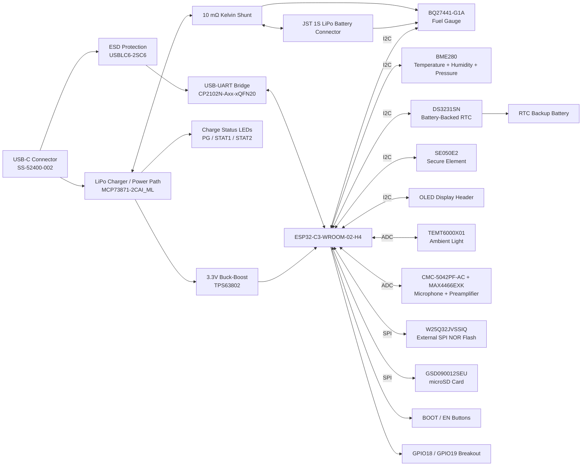

# Secure-Ready Battery-Powered Edge Logger — ESP32-C3

A custom-designed battery-powered edge logging platform built around the **ESP32-C3-WROOM-02**, evolved from the original IoT Development Board into a more complete embedded system with persistent timekeeping, hardware-backed security, battery-state monitoring, regulated battery operation, local storage, environmental sensing, ambient light sensing, audio capture, and USB-C programming/debug support. Designed end-to-end in **KiCad 10**, from schematic capture through PCB layout and routing.

---

## Overview

This board is a **secure-ready, battery-powered edge data-logging platform** — capable of acquiring sensor data, maintaining absolute time across power interruptions, storing data locally, monitoring its own battery state, and supporting hardware-protected device identity and cryptographic operations.

The ESP32-C3 remains the main processing and wireless controller, with critical system functions separated into dedicated hardware blocks: LiPo charging and power-path management (MCP73871), regulated buck-boost 3.3V conversion (TPS63802), battery fuel gauging (BQ27441-G1A), persistent real-time clock (DS3231SN), hardware-backed key storage (SE050E2), and local storage across microSD and external SPI flash.

**Applications:**
- Battery-powered environmental and acoustic edge logging
- Offline, timestamped sensor-data acquisition
- Secure-ready IoT edge nodes requiring protected device credentials
- Battery-aware embedded sensing platforms
- Zephyr RTOS hardware/driver development and validation

**Key design goals:**
- Reliable operation from both USB-C and a single-cell LiPo battery
- Regulated 3.3V operation across the full LiPo discharge range
- Battery charging, power-path management, and state-of-charge monitoring
- Persistent absolute time, independent of network availability
- Hardware support for protected device identity and cryptographic keys
- Local timestamped data logging through microSD and external SPI flash
- Environmental, ambient-light, and acoustic sensing
- USB-to-UART programming/debugging without an external serial adapter
- Shared I²C expansion with an external OLED header

---

## Block Diagram



---

## Hardware Overview

### Power & Battery Management
| Component | Part Number | Function |
|---|---|---|
| USB-C Connector | SS-52400-002 | Main external power/data input |
| ESD Protection | USBLC6-2SC6 | Protects USB D+/D- from ESD transients |
| LiPo Charger / Power Path | MCP73871-2CAI_ML | Single-cell Li-Ion/LiPo charging and load-sharing/power-path management |
| 3.3V Regulator | TPS63802 | Buck-boost conversion for regulated 3.3V operation across the variable battery rail |
| Fuel Gauge | BQ27441-G1A | Battery voltage/current, state-of-charge, remaining-capacity, and health estimation |
| Current-Sense Resistor | 10 mΩ, 4-terminal Kelvin shunt | High-side charge/discharge current measurement for the BQ27441 |
| Battery Connector | JST 2-pin | Single-cell LiPo connection |
| Status Indicators | LED x3 | MCP73871 charging / charge-complete / power-good indication |

The MCP73871 controls the USB/battery power path exactly as in Rev 1 — powering the system while charging over USB, and switching seamlessly to battery when USB is removed.

The original **LM1117-3.3 linear regulator was replaced with a TPS63802 buck-boost converter**, since a single-cell LiPo spends most of its discharge curve below 3.3V toward the low end of its range — a linear regulator alone can't hold 3.3V once the input drops below it. The buck-boost stage keeps the 3.3V rail regulated whether the battery sits above or below that threshold.

The BQ27441-G1A measures charge/discharge current through a dedicated 10 mΩ Kelvin shunt inserted between the battery and the MCP73871's VBAT side, with dedicated SRP/SRN sense connections routed directly to the shunt's sense terminals to minimize measurement error.

### Timekeeping & Hardware Security
| Component | Part Number | Interface | Function |
|---|---|---|---|
| Real-Time Clock | DS3231SN | I²C | Battery-backed absolute time for timestamped logging |
| Secure Element | NXP EdgeLock SE050E2 | I²C | Hardware-protected key storage, device identity, signing, and cryptographic operations |

The DS3231SN provides absolute time independent of WiFi/network availability, retaining time through main-power interruptions via its own backup supply. Its **INT/SQW** output connects to **ESP32-C3 GPIO8** for alarm/square-wave functionality.

The SE050E2 provides the hardware foundation for a device root of trust — generating and storing private keys internally and performing cryptographic operations without ever exposing key material to the ESP32 application. Its presence makes the platform *secure-ready*; actual authentication/TLS/signing behavior still needs to be implemented at the firmware level.

### Core & Connectivity
| Component | Part Number | Function |
|---|---|---|
| MCU | ESP32-C3-WROOM-02-H4 | RISC-V, WiFi + BLE, main system controller |
| USB-UART Bridge | CP2102N-Axx-xQFN20 | USB-to-serial for programming/debugging |
| Flash Memory | W25Q32JVSSIQ | 32Mbit external SPI flash (firmware/config storage) |
| SD Card Socket | GSD090012SEU | microSD card slot (bulk data storage: logs, audio, images) |

Programming and debugging run over native USB via the CP2102N — USB-C → CP2102N → UART0 — with manual **BOOT** and **EN** pushbuttons as a direct hardware fallback.

### Sensors
| Component | Part Number | Interface | Function |
|---|---|---|---|
| Environmental Sensor | BME280 | I²C | Temperature, humidity, and barometric pressure |
| Ambient Light Sensor | TEMT6000X01 | Analog (ADC) | Ambient light intensity |
| Microphone Capsule | CMC-5042PF-AC | Analog | Electret condenser microphone |
| Mic Preamplifier | MAX4466EXK+T | Analog (ADC) | Adjustable-gain (25x–125x) microphone amplifier |

### User Interface / Expansion
- **BOOT** and **EN** pushbuttons for manual firmware flashing / reset
- **OLED display header** on the shared I²C bus
- **GPIO18 / GPIO19 breakout**, remaining available for alternate functions such as native USB/JTAG when not assigned by the application
- **GPIO8 is no longer spare** — it is now assigned to the DS3231SN's `INT/SQW` signal

---

## Shared Bus Architecture

**SPI bus** (microSD card + external SPI NOR flash, shared MOSI/MISO/SCLK, independent CS lines):
```
ESP32 MOSI ──┬──▶ microSD MOSI
             └──▶ W25Q32 MOSI

ESP32 MISO ──┬──◀ microSD MISO
             └──◀ W25Q32 MISO

ESP32 SCLK ──┬──▶ microSD SCLK
             └──▶ W25Q32 SCLK

ESP32 GPIO5  ───▶ microSD CS
ESP32 GPIO10 ───▶ W25Q32 CS
```

**I²C bus** (BME280, OLED header, DS3231SN, BQ27441-G1A, and SE050E2 — all sharing one SDA/SCL bus):
```
ESP32 GPIO4 / SDA ──┬── BME280
                    ├── OLED header
                    ├── DS3231SN
                    ├── BQ27441-G1A
                    └── SE050E2

ESP32 GPIO3 / SCL ──┬── BME280
                    ├── OLED header
                    ├── DS3231SN
                    ├── BQ27441-G1A
                    └── SE050E2
```

The bus uses a single shared pull-up network located near the BME280 — since every device sits on the same SDA/SCL nets, all five devices share the same pull-up pair rather than each getting its own. Routing is primarily linear, with a short branch/stub to the SE050E2. Bus speed is currently configured conservatively in the Zephyr board definition, pending post-fabrication validation of SDA/SCL rise time across all five devices.

---

## Design Tools

- **Schematic capture & PCB layout:** KiCad 10
- **Simulation/verification:** KiCad ERC & DRC (Electrical Rules Checker / Design Rules Checker)
- **Firmware / board support:** Zephyr RTOS
- **Secure-element middleware:** NXP Plug & Trust, for SE050E2
- **Hardware config tools:** Silicon Labs Simplicity Studio / Xpress Configurator (for one-time CP2102N GPIO/TXT-RXT configuration)

The Zephyr board port was updated for the Rev 2 hardware to add: DS3231 RTC integration, BQ27441 fuel-gauge integration through Zephyr's sensor subsystem, SE050 I²C transport mapping for NXP Plug & Trust, and GPIO8 allocation for the RTC's `INT/SQW` line — alongside the existing BME280, ADC, SPI NOR, microSD, UART, and GPIO support carried over from Rev 1.

---

## Repository Structure

This is a native **KiCad 10** hierarchical project — keep the main project file, root schematic, PCB file, and every child schematic sheet together so the hierarchy resolves correctly when cloned.

```
├── rev2-secure-edge-logger.kicad_pro   # Main KiCad project file
├── rev2-secure-edge-logger.kicad_sch   # Root schematic sheet
├── rev2-secure-edge-logger.kicad_pcb   # PCB layout
│
├── ESP32-C3-02.kicad_sch               # Sub-sheet: MCU + core connectivity
├── sensors.kicad_sch                   # Sub-sheet: BME280, light sensor, mic/amp
├── userInterface.kicad_sch             # Sub-sheet: BOOT/EN buttons, OLED header, breakout
│
├── Gerbers/                            # Exported Gerber/drill files, once generated
├── Libraries/                          # Custom footprints, symbols, and 3D models
├── BOM.csv                             # Bill of materials
├── fp-lib-table                        # Footprint library table
├── sym-lib-table                       # Symbol library table
└── renders/                            # PCB renders / project images
```

> Lock files (`*.lck`), `.history/`, and `.git/` are local/version-control housekeeping and not part of the design itself.

---

## Known Issues & Design Notes

- **Power architecture change:** the original LM1117-3.3 LDO was replaced with a TPS63802 buck-boost converter, since the LiPo's voltage range crosses above and below 3.3V — a linear regulator alone can't hold the rail once the battery drops below it.
- **Buck-boost layout:** TPS63802 input/output capacitors and the 0.47µH inductor are placed close to the regulator, with short/wide switching-current paths, and the feedback network routed away from the switching nodes.
- **Fuel-gauge measurement:** BQ27441 SRP/SRN use Kelvin connections directly to the 10mΩ four-terminal shunt; battery-voltage sensing is taken from the battery side of the shunt.
- **Charging vs. gauging are separate concerns:** the MCP73871's status outputs (PG, STAT1, STAT2) indicate *charger* state, not battery percentage — state-of-charge and remaining-capacity estimation is handled entirely by the BQ27441.
- **I²C pull-ups:** the entire bus (5 devices) uses one shared pull-up pair. Any future external module added to the OLED header needs to account for this — extra pull-ups on that module would combine in parallel and lower the effective bus resistance.
- **RTC interrupt:** DS3231SN's `INT/SQW` is open-drain, connected to GPIO8 — pull-up behavior needs to match the final hardware/firmware configuration.
- **Secure element scope:** SE050E2 provides the hardware capability for key storage and cryptographic operations, but the board should only be described as "cryptographically secured" once firmware actually provisions and uses those functions — the chip alone doesn't make the system secure.
- **GPIO5 / ADC2 conflict** (carried over from Rev 1): GPIO5 is the ESP32-C3's only ADC2 channel and is unreliable while WiFi is active. Analog signals (microphone, light sensor) use ADC1 pins instead; GPIO5 itself is used here purely as a digital SPI chip-select, where this limitation doesn't apply.
- **CP2102N TXT/RXT indicator LEDs:** default to plain GPIO mode from the factory and require explicit configuration via Silicon Labs' Xpress Configurator to enable the TXT/RXT alternate function.
- **SD card DAT3/CS line** requires a pull-up resistor so the card initializes into SPI mode rather than native SD mode at power-up.

---

## Planned Additions

- **Enclosure design (SolidWorks)** — case built around the Rev 2 board's exported KiCad STEP file, with cutouts for the USB-C port, BOOT/EN buttons, status LEDs, SD card slot, and a light-transmissive window over the ambient light sensor.
- **Firmware-level use of the SE050E2** — provisioning device keys and implementing signing/authentication flows, moving the board from *secure-ready* to actually secured.
- **Battery runtime characterization** — active/sleep current measurement once hardware is available, to validate real-world battery life against the BQ27441's reporting.

---

## Evolution from Rev 1

**Rev 1 — IoT Development Board** established the base platform: ESP32-C3 WiFi/BLE processing, BME280 environmental sensing, ambient-light and acoustic sensing, microSD + SPI NOR storage, LiPo charging and power-path management, USB-UART programming/debugging, OLED/GPIO expansion, and the initial custom Zephyr board port.

**Rev 2** extends that base around four system-level additions:

| Requirement | Change |
|---|---|
| Persistent timekeeping | Added DS3231SN with backup supply and RTC alarm/square-wave on GPIO8 |
| Hardware-backed security | Added NXP EdgeLock SE050E2 for protected device identity, key storage, and signing |
| Battery-state observability | Added BQ27441-G1A with 10mΩ Kelvin current sensing for voltage/current/SOC/health |
| Battery-range power regulation | Replaced LM1117-3.3 with TPS63802 buck-boost to hold 3.3V across the full LiPo range |

The result is no longer a general-purpose IoT development board — the architecture is now built around autonomous, timestamped, battery-aware logging with hardware security readiness built in from the start.

---

## Acknowledgments

Board design informed by manufacturer reference designs and application notes from Espressif, Microchip, Texas Instruments, NXP, Analog Devices/Maxim, Silicon Labs, Bosch Sensortec, Winbond, and the Zephyr Project.
